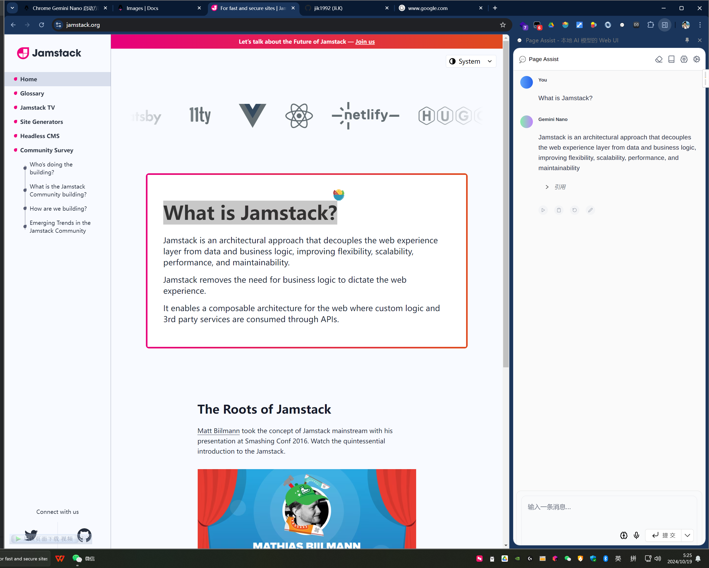

## 方法
* chrome 版本大于 126
* 进入 chrome://flags，打开以下两个选项
  * Enables BypassPerf: optimization guide on device
  * Enabled ：Prompt API for Gemini Nano
* 进入 console 输入 ```await window.ai.assistant.create()```
* 进入 chrome://components/ 更新以下组件
  * 找到 Optimization Guide On Device Model 然后 update 

## 使用方法
* 在线体验 https://chrome-ai-demo.vercel.app/
* 在线体验2 https://github.com/n4ze3m/page-assist

## 引用
* https://github.com/lightning-joyce/chromeai/issues/6
* https://www.cnblogs.com/jopny/p/18268372/How_to_install_config_use_Gemini_AI_Nano_in_Chrome