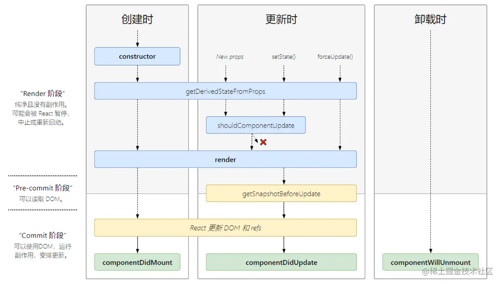

## FED知识内容

### 基础 HTML/CSS

* `<meta name="viewport" content="width=device-width,initial-scale=1" />`
* SEO
* heading、p、list、a、from、input、img、table、div

#### CSS

* selector、attribute
* type、class、id selector
* image float, clean:left;
* sizing: 1px 1em 1vw 1% fit-content
* text: line-height text-align vertical-align, column-count:3
* pseudo-classes ```:hover :first-child``` pseudo-elements ```::first-line```
* flexbox
    * [flex](https://developer.mozilla.org/en-US/docs/Learn/CSS/CSS_layout/Flexbox) flex-direction flex-align
      flex-content shark
    * [grid](https://developer.mozilla.org/en-US/docs/Learn/CSS/CSS_layout/Grids)

```css
.div {
    display: grid;
    grid-template-columns: repeat(2, 1fr);
    gap: 20px;
    grid-auto-rows: minmax(100px, auto);
}
```

* box model: padding margin border
* display inline: block inline-block inline-flex flex
* position relative、absolute、fix,sticky,static
* spacing work-break:break-all white-space:nowrap
* shadow radio
* overflow content
* font-family：sans-serif、serif、monospace；test-font:cursive、fantasy

```css
.div {
    overflow: hidden;
    text-overflow: ellipsis;
    display: -webkit-box;
    line-clamp: 4;
    -webkit-line-clamp: 4;
    -webkit-box-orient: vertical;
}

.div {
    overflow: hidden;
    text-overflow: ellipsis;
    white-space: nowrap;
}
```

* media query

```css
@media screen and (min-width: 80rem) {
    .container {
        margin: 1em 2em;
    }
}

```

* modal align

```css
.div {
    position: absolute;
    left: 50%;
    top: 50%;
    transform: translate(-50%, -50%);
}
```

##### Tailwindcss

* [CSS3](https://web.dev/learn/css)
* [Tailwindcss](https://tailwindcss.com/) 目前支持面非常的广，基础语法写几遍能记住。是CSS3的另一种描述

```
    "tailwind-merge": "^2.2.1",
    "tailwindcss-animate": "^1.0.7",
    "tailwindcss": "^3.4.3"
```

```css
@tailwind base;
@tailwind components;
@tailwind utilities;
```

tailwind.config.ts

```ts
import type {Config} from 'tailwindcss';
import defaultTheme from 'tailwindcss/defaultTheme';
import tailwindcssAnimate from 'tailwindcss-animate';

export default {
    content: ['./app/**/*.{js,jsx,ts,tsx}', '../ui/components/**/*.{ts,tsx}', '../emligand/**/*.{ts,tsx}'],
    theme: {
        container: {
            center: true,
            padding: '2rem',
        },
        screens: {
            desktop: '1536px',
            ...defaultTheme.screens,
        },
        fontFamily: {
            'pack-sans': ['Inter', 'Segoe UI', 'SF Pro', 'sans-serif'],
            'pack-serif': ['Georgia', ...defaultTheme.fontFamily.serif],
            'pack-mono': ['Consolas', ...defaultTheme.fontFamily.mono],
        },
        extend: {
            colors: {
                border: 'hsl(var(--border))',
            },
            borderRadius: {
                lg: `var(--radius)`,
                md: `calc(var(--radius) - 2px)`,
                sm: 'calc(var(--radius) - 4px)',
            },
            fontFamily: {
                sans: ['var(--font-sans)', ...defaultTheme.fontFamily.sans],
            },
            keyframes: {
                'accordion-down': {
                    from: {height: '0'},
                    to: {height: 'var(--radix-accordion-content-height)'},
                },
                'accordion-up': {
                    from: {height: 'var(--radix-accordion-content-height)'},
                    to: {height: '0'},
                },
            },
            animation: {
                'accordion-down': 'accordion-down 0.2s ease-out',
                'accordion-up': 'accordion-up 0.2s ease-out',
            },
        },
    },
    plugins: [tailwindcssAnimate],
} satisfies Config;

```

##### CSS3/Tailwindcss UI 框架

* https://github.com/saadeghi/daisyui
* https://github.com/tailwindlabs/headlessui

### Javascript 相关

#### JS 基础

* 重要的七大对象：window location document history cookie storage httpRequest
* ServiceWorker

#### Vite/webpack5 编译

提供模块化打包，和runtime HMR高性能加载的开发环境

```
## Setup
- Make sure you are on node v20, consider use nvm if you need to switch between versions
- Make sure corepack in enabled, `corepack enable`
- `yarn --version`, make sure you are on v4.1.1
- run `yarn install`
```

* [webpack5](https://webpack.js.org/concepts/) 编译
    * 使用 workspaces
    * 使用 HMR
* vite 运行时，HMR使用
* husky pre-commit工具
* prettier 代码 format

#### Typescript/Nodejs

##### 基础语法

* number/string const/let
* await/async Promise.all
* interface/type/class/extends/statics/typeof/instanceof
* Generics: `logLength<T extends Lengthwise = string>(arg: T)`
    * Partial 可选 Required 必须
    * Readonly 只读 Record 约束
    * Pick 挑出、Exclude 排除、Omit 忽略、NonNullable不可为空
* [immutability-helper](https://github.com/kolodny/immutability-helper)
    * 不可变集合 ```$push $unshift $set```
* [lodash](https://lodash.com/) 基础函数库 notEmpty、Collection、cloneDeep、debounce/throttle
* [zod](https://github.com/colinhacks/zod) 数据schema校验工具
* [tslint](https://palantir.github.io/tslint/)
* [react-responsive](https://github.com/yocontra/react-responsive)响应式检查
* [commander](https://github.com/tj/commander.js) 命令行参数配置
* effective code
    * requestAnimationFrame
    * add/remove listener
    * compress、gzip
    * lazyImageLoaded
    * Web Workers/Webassembly
    * lazy import
    * compress image or use WEBP
* d.ts 申明

``` 
declare module Runoob { 
   export class Calc { 
      doSum(limit:number) : number; 
   }
}
```

引入

```
/// <reference path = "Calc.d.ts" /> 
var obj = new Runoob.Calc(); 
// obj.doSum("Hello"); // 编译错误
console.log(obj.doSum(10));
```

#### Nodejs 并发相关

* {exec,fork} from child_process
* workerProcess.send('message',{})
* workerProcess.on('message')

#### React18

* 基础生命周期
  
* [React hooks](https://react.dev/reference/react-dom/hooks)
    * 常用的 useMemo、useState、useContext、useEffect、useCallback
* [redux](https://github.com/reduxjs/redux) [reselect](https://github.com/reduxjs/reselect) 缓存 redux
* [memoize-one](https://github.com/alexreardon/memoize-one)
* [React Fiber 介绍](https://zhuanlan.zhihu.com/p/26027085)

#### SSR

* Remix [component](https://remix.run/docs/en/1.19.2/components)
* [Next.js](https://nextjs.org/)

#### DockerFile

```dockerfile
FROM node:20-alpine AS builder
WORKDIR /app

COPY . .
RUN rm -r ./packages/prev-gen
RUN corepack enable
RUN yarn install
RUN yarn pack:build

FROM node:20-alpine AS production
WORKDIR /app

COPY package.json ./package.json
COPY yarn.lock ./yarn.lock
COPY .yarn ./.yarn
COPY .yarnrc.yml ./.yarnrc.yml
COPY packages/common ./packages/common
COPY packages/ui ./packages/ui
COPY packages/emligand ./packages/emligand
COPY packages/xxx-common ./packages/xxx-common

COPY packages/xxx-pack/package.json ./packages/xxx-pack/package.json
COPY --from=builder /app/packages/xxx-pack/build ./packages/xxx-pack/build
RUN corepack enable
RUN yarn workspaces focus @xxx/xxx-pack --production

CMD ["yarn", "pack:start"]
```

package.json

```json
{
  "name": "xxx-typescript",
  "private": true,
  "scripts": {
    "prettier": "node_modules/.bin/prettier 'packages/**/*.{ts,tsx}'",
    "tslint": "yarn workspaces foreach -A run tslint",
    "lint": "yarn workspaces foreach -A run lint",
    "typecheck": "yarn workspaces foreach -A run typecheck",
    "prepare": "cd .. && husky xxx-typescript/.husky"
  },
  "lint-staged": {
    "*.{ts,tsx}": [
      "yarn prettier --write"
    ]
  },
  "devDependencies": {
    "husky": "^9.0.11",
    "lint-staged": "^15.2.7",
    "prettier": "^3.2.5",
    "prettier-plugin-tailwindcss": "^0.6.5"
  },
  "packageManager": "yarn@4.3.1",
  "workspaces": [
    "packages/*"
  ],
  "resolutions": {
    "@radix-ui/react-focus-guards@npm:1.0.1": "patch:@radix-ui/react-focus-guards@npm%3A1.0.1#~/.yarn/patches/@radix-ui-react-focus-guards-npm-1.0.1-415ba52867.patch"
  }
}
```

### Python相关

* 网络RestAPI框架 aiohttp
* 工程相关 pytest、lint、typing、pydantic
* 数学库 numpy、pandas
* UI库 streamlit、qt6
