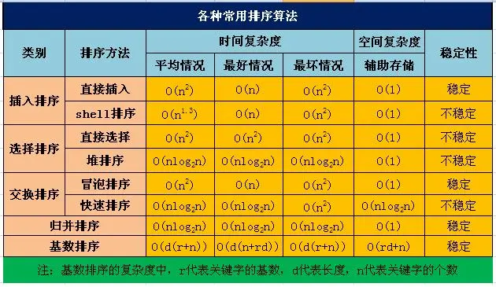

# 学习算法小抄笔记

## 时间复杂度表示法

时空复杂度用 Big 0 表示法表示(类似 O(1),O(n2),0(logn)等)。它们都是估计值，不需要精确计算，且仅保留最高增长项。

## 数据结构

Tree、Array、List、 、Hash、图

* Array
* List
* Queue、Stack
* 树
    * 二叉树
    * 二叉排序树
    * 满二叉树
    * 完全二叉树
    * 平衡二叉树
    * AVL（二叉搜索树）
    * 红黑树（二叉搜索树）
    * 哈夫曼树
    * B树 B+树
    * 二叉堆
    * BST（Binary Search Tree）
    * Tier 树
    * DFS、BFS
    * Dijkstra
* 图 Union-Find

## 算法分类

* 动态（Dynamic Program）规划求最值，三要素：重叠子问题、最优子结构、状态转移方程，动态规划本质是穷举所有问题的和，用N叉来看待，带备忘录
    * 最长递增子序列（LIS）、LCS
    * 背包问题
    * 零钱兑换
    * 高楼扔鸡蛋、戳气球、
    * 正则表达
    * 四键键盘
    * 字符串匹配算法 KMP
    * 编辑距离 DP+回溯
    * 股票买卖 DPTable
    * House Robber
* 回溯
    * 决策树，N皇后问题
    * DFS、BFS（找二叉树最小路径）
    * 排列、子集、组合
    * 树独、合法括号
* 双指针
    * 快慢指针（判断是否有环）、二分法 左边界二分法、右边界二分法
    * 滑动窗口算法 最小覆盖子串、字符串排列、找到字符串中所有的异位词、无重复字符串最长子串
    * 两数之和、反转数组
* 贪心算法 局部导致全局最优
    * 区间调度
* 二分图
* 二叉堆 PriorityQueue、Twitter
* 哈希表-双向链表 LRU、LFU、twoSum
* 树
    * BST
    * 线索树
    * Tried Tree
    * LSM-Tree
* monotonic stack
* 单调队列 滑动窗口、最小覆盖字串
* 链表问题 双指针、左右指针、滑动窗口
* 位操作
    * |
    * n&(n-1)
* 双精度计算
* FooldFill 扫雷、消除、自动魔棒
* 排序问题
  
* 信封嵌套问题

### 分布式 CAP/BASE 算法

* Raft
* Paxso ZAB

### 未分类算法

* MySQL的 B+ 树
* Redis、Dubbo的负载均衡 一致性hash
    * 2^32 上生成一个环、设置服务器的hash以及位置、目标key通过hashcode查找目标key顺时针最近的服务器节点
    * Redis默认的HASH一致性算法 KETAMA_HASH
* CPU多线程运行队列，cfs_rq 红黑树,几何计算
    * 主要用于存储有序的数据，相当于忽略排序过程
    * JDK红黑树代码实现TreeMap
    * 红黑树 ceilingEntry直接取右边第一个节点，如果为null即结束
* 字典树,对于中文的字典树，每个节点的子节点用一个哈希表存储，这样就不用浪费太大的空间，而且查询速度上可以保留哈希的复杂度O(
  1)。
    * 根节点不包含字符，除根节点外每一个节点都只包含一个字符。
    * 从根节点到某一节点，路径上经过的字符连接起来，为该节点对应的字符串。
    * 每个节点的所有子节点包含的字符都不相同。
* FST 状态机
    * 空间占用小。通过对词典中单词前缀和后缀的重复利用，压缩了存储空间
    * 查询速度快。O(len(str))的查询时间复杂度

### Google 算法

* 分布式日志 Dapper
* 分布式文件 GFS (Bloom filter)
* 分布式调度 MapReduce （Hadoop）
* 分布式数据库 Bigtable(LevelDB LSM-tree)

### 权重随机数

* 随机算法
* 权重随机
* 权重保底随机
* [PRD保底概率实现](https://zhuanlan.zhihu.com/p/534645684)
* [马尔科夫链](https://zhuanlan.zhihu.com/p/440962025)

## 常用算法

### 归并排序

```javascript
function mergeSort(arr) {
    if (arr.length < 2) {
        return arr;
    }
    const mid = Math.floor(arr.length / 2);
    const left = mergeSort(arr.slice(0, mid));
    const right = mergeSort(arr.slice(mid));
    return merge(left, right);
}

function merge(left, right) {
    let result = [];
    while (left.length && right.length) {
        if (left[0] < right[0]) {
            result.push(left.shift());
        } else {
            result.push(right.shift());
        }
    }
    return result.concat(left.slice() || right.slice());
}
```

### 八皇后

```javascript
function solveNQueens(n) {
    const results = [];
    const board = Array.from({length: n}, () => new Array(n).fill('.'));

    function placeQueen(row, queens) {
        if (row === n) {
            const result = [];
            queens.forEach((queen, index) => {
                const solution = board.map((row, i) => row.map(cell => cell === 'Q' ? 'Q' : '.'));
                solution[queen][index] = 'Q';
                result.push(solution.map(row => row.join('')).join('\n'));
            });
            results.push(...result);
            return;
        }

        for (let col = 0; col < n; col++) {
            if (isSafe(row, col, queens)) {
                board[row][col] = 'Q';
                placeQueen(row + 1, queens.concat(col));
                board[row][col] = '.';
            }
        }
    }

    function isSafe(row, col, queens) {
        for (let i = 0; i < row; i++) {
            if (board[i][col] === 'Q' || queens.includes(i * n + col)) {
                return false;
            }
        }
        let left = col - 1, right = col + 1, i = row - 1;
        while (i >= 0 && left >= 0) {
            if (board[i][left--] === 'Q') return false;
            i--;
        }
        while (i >= 0 && right < n) {
            if (board[i][right++] === 'Q') return false;
            i--;
        }
        return true;
    }

    placeQueen(0, []);
    return results;
}
```

### 编辑距离

```javascript
function minDistance(word1, word2) {
    return editDist(word1, word2, word1.length, word2.length);
}

function editDist(str1, str2, m, n) {
    if (m === 0) return n;
    if (n === 0) return m;

    if (str1[m - 1] === str2[n - 1]) {
        return editDist(str1, str2, m - 1, n - 1);
    }

    return 1 + Math.min(
        editDist(str1, str2, m, n - 1),
        editDist(str1, str2, m - 1, n),
        editDist(str1, str2, m - 1, n - 1)
    );
}


```

### LCS字符串问题

```javascript
function lcs(str1, str2) {
    const memo = new Map();

    function lcsHelper(i, j) {
        const key = `${i},${j}`;

        if (i === 0 || j === 0) return 0;

        if (memo.has(key)) return memo.get(key);

        let result;
        if (str1[i - 1] === str2[j - 1]) {
            result = 1 + lcsHelper(i - 1, j - 1);
        } else {
            result = Math.max(
                lcsHelper(i - 1, j),
                lcsHelper(i, j - 1)
            );
        }

        memo.set(key, result);
        return result;
    }

    return lcsHelper(str1.length, str2.length);
}

// 使用示例
console.log(lcs("ABCDGH", "AEDFHR"));  // 3
```

### LCS 连续最长公共子序列

```javascript
function lcSubstring(str1, str2) {
    let maxLength = 0;
    let resultSubstring = '';

    // 对于str1的每个字符
    for (let i = 0; i < str1.length; i++) {
        // 对于str2的每个字符
        for (let j = 0; j < str2.length; j++) {
            let length = 0;
            // 当前位置开始匹配
            while (
                i + length < str1.length &&
                j + length < str2.length &&
                str1[i + length] === str2[j + length]
                ) {
                length++;
            }

            // 更新最大长度
            if (length > maxLength) {
                maxLength = length;
                resultSubstring = str1.slice(i, i + length);
            }
        }
    }

    return {
        length: maxLength,
        substring: resultSubstring
    };
}
```

### DFS/BFS 遍历

```javascript
// 递归版本
function dfs(graph, start, visited = new Set()) {
    visited.add(start);
    console.log(start);

    for (let neighbor of graph[start]) {
        if (!visited.has(neighbor)) {
            dfs(graph, neighbor, visited);
        }
    }
}

// 迭代版本(使用栈)
function dfsIterative(graph, start) {
    const stack = [start];
    const visited = new Set();

    while (stack.length > 0) {
        const vertex = stack.pop();

        if (!visited.has(vertex)) {
            visited.add(vertex);
            console.log(vertex);

            for (let neighbor of graph[vertex]) {
                if (!visited.has(neighbor)) {
                    stack.push(neighbor);
                }
            }
        }
    }
}

// 使用示例
const graph = {
    'A': ['B', 'C'],
    'B': ['A', 'D', 'E'],
    'C': ['A', 'F'],
    'D': ['B'],
    'E': ['B', 'F'],
    'F': ['C', 'E']
};

dfs(graph, 'A');
// 或
dfsIterative(graph, 'A');
```

```javascript
// 队列实现BFS
function bfs(graph, start) {
    const queue = [start];
    const visited = new Set([start]);

    while (queue.length > 0) {
        const vertex = queue.shift();
        console.log(vertex);

        for (let neighbor of graph[vertex]) {
            if (!visited.has(neighbor)) {
                visited.add(neighbor);
                queue.push(neighbor);
            }
        }
    }
}

// 层序遍历版本
function bfsLevelOrder(graph, start) {
    const queue = [start];
    const visited = new Set([start]);

    while (queue.length > 0) {
        const levelSize = queue.length;
        const currentLevel = [];

        for (let i = 0; i < levelSize; i++) {
            const vertex = queue.shift();
            currentLevel.push(vertex);

            for (let neighbor of graph[vertex]) {
                if (!visited.has(neighbor)) {
                    visited.add(neighbor);
                    queue.push(neighbor);
                }
            }
        }
        console.log(currentLevel);
    }
}

// 使用示例
const graph = {
    'A': ['B', 'C'],
    'B': ['A', 'D', 'E'],
    'C': ['A', 'F'],
    'D': ['B'],
    'E': ['B', 'F'],
    'F': ['C', 'E']
};

bfs(graph, 'A');
// 或
bfsLevelOrder(graph, 'A');
```

### 红黑树

```javascript
class Node {
    constructor(data) {
        this.data = data;
        this.left = null;
        this.right = null;
        this.parent = null;
        this.color = 'RED';
    }
}

class RedBlackTree {
    constructor() {
        this.nil = new Node(null);
        this.nil.color = 'BLACK';
        this.root = this.nil;
    }

    leftRotate(x) {
        const y = x.right;
        x.right = y.left;
        if (y.left !== this.nil) {
            y.left.parent = x;
        }
        y.parent = x.parent;
        if (x.parent === this.nil) {
            this.root = y;
        } else if (x === x.parent.left) {
            x.parent.left = y;
        } else {
            x.parent.right = y;
        }
        y.left = x;
        x.parent = y;
    }

    rightRotate(x) {
        const y = x.left;
        x.left = y.right;
        if (y.right !== this.nil) {
            y.right.parent = x;
        }
        y.parent = x.parent;
        if (x.parent === this.nil) {
            this.root = y;
        } else if (x === x.parent.right) {
            x.parent.right = y;
        } else {
            x.parent.left = y;
        }
        y.right = x;
        x.parent = y;
    }

    insert(data) {
        const node = new Node(data);
        let y = this.nil;
        let x = this.root;

        while (x !== this.nil) {
            y = x;
            if (node.data < x.data) {
                x = x.left;
            } else {
                x = x.right;
            }
        }

        node.parent = y;
        if (y === this.nil) {
            this.root = node;
        } else if (node.data < y.data) {
            y.left = node;
        } else {
            y.right = node;
        }

        node.left = this.nil;
        node.right = this.nil;
        this.insertFixup(node);
    }

    insertFixup(z) {
        while (z.parent.color === 'RED') {
            if (z.parent === z.parent.parent.left) {
                const y = z.parent.parent.right;
                if (y.color === 'RED') {
                    z.parent.color = 'BLACK';
                    y.color = 'BLACK';
                    z.parent.parent.color = 'RED';
                    z = z.parent.parent;
                } else {
                    if (z === z.parent.right) {
                        z = z.parent;
                        this.leftRotate(z);
                    }
                    z.parent.color = 'BLACK';
                    z.parent.parent.color = 'RED';
                    this.rightRotate(z.parent.parent);
                }
            } else {
                const y = z.parent.parent.left;
                if (y.color === 'RED') {
                    z.parent.color = 'BLACK';
                    y.color = 'BLACK';
                    z.parent.parent.color = 'RED';
                    z = z.parent.parent;
                } else {
                    if (z === z.parent.left) {
                        z = z.parent;
                        this.rightRotate(z);
                    }
                    z.parent.color = 'BLACK';
                    z.parent.parent.color = 'RED';
                    this.leftRotate(z.parent.parent);
                }
            }
        }
        this.root.color = 'BLACK';
    }

    delete(data) {
        let z = this.search(data);
        if (!z) return false;

        let y = z;
        let x;
        let originalColor = y.color;

        if (z.left === this.nil) {
            x = z.right;
            this.transplant(z, z.right);
        } else if (z.right === this.nil) {
            x = z.left;
            this.transplant(z, z.left);
        } else {
            y = this.minimum(z.right);
            originalColor = y.color;
            x = y.right;
            if (y.parent === z) {
                x.parent = y;
            } else {
                this.transplant(y, y.right);
                y.right = z.right;
                y.right.parent = y;
            }
            this.transplant(z, y);
            y.left = z.left;
            y.left.parent = y;
            y.color = z.color;
        }

        if (originalColor === 'BLACK') {
            this.deleteFixup(x);
        }
        return true;
    }

    deleteFixup(x) {
        while (x !== this.root && x.color === 'BLACK') {
            if (x === x.parent.left) {
                let w = x.parent.right;
                if (w.color === 'RED') {
                    w.color = 'BLACK';
                    x.parent.color = 'RED';
                    this.leftRotate(x.parent);
                    w = x.parent.right;
                }
                if (w.left.color === 'BLACK' && w.right.color === 'BLACK') {
                    w.color = 'RED';
                    x = x.parent;
                } else {
                    if (w.right.color === 'BLACK') {
                        w.left.color = 'BLACK';
                        w.color = 'RED';
                        this.rightRotate(w);
                        w = x.parent.right;
                    }
                    w.color = x.parent.color;
                    x.parent.color = 'BLACK';
                    w.right.color = 'BLACK';
                    this.leftRotate(x.parent);
                    x = this.root;
                }
            } else {
                let w = x.parent.left;
                if (w.color === 'RED') {
                    w.color = 'BLACK';
                    x.parent.color = 'RED';
                    this.rightRotate(x.parent);
                    w = x.parent.left;
                }
                if (w.right.color === 'BLACK' && w.left.color === 'BLACK') {
                    w.color = 'RED';
                    x = x.parent;
                } else {
                    if (w.left.color === 'BLACK') {
                        w.right.color = 'BLACK';
                        w.color = 'RED';
                        this.leftRotate(w);
                        w = x.parent.left;
                    }
                    w.color = x.parent.color;
                    x.parent.color = 'BLACK';
                    w.left.color = 'BLACK';
                    this.rightRotate(x.parent);
                    x = this.root;
                }
            }
        }
        x.color = 'BLACK';
    }

    transplant(u, v) {
        if (u.parent === this.nil) {
            this.root = v;
        } else if (u === u.parent.left) {
            u.parent.left = v;
        } else {
            u.parent.right = v;
        }
        v.parent = u.parent;
    }

    search(data) {
        let current = this.root;
        while (current !== this.nil && data !== current.data) {
            if (data < current.data) {
                current = current.left;
            } else {
                current = current.right;
            }
        }
        return current === this.nil ? null : current;
    }

    minimum(node) {
        while (node.left !== this.nil) {
            node = node.left;
        }
        return node;
    }
}
```