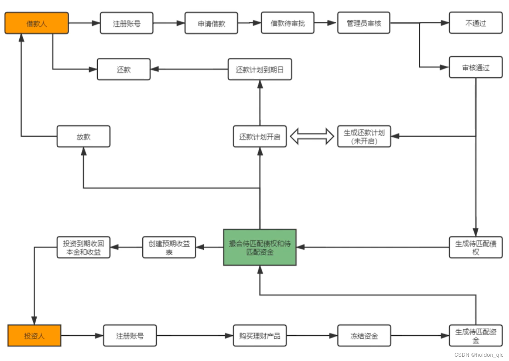

推荐、广告、搜索相关架构和算法整理

## 广告

Hypers平台

* CDP 客户数据平台
    * 渠道接入 埋点对接、广告数据、业务系统、数据库、电商平台
    * 数据治理 标准化数据、规范化、接口化、可视化
    * 数据关联
    * 标签和人群圈选 用户分层
    * 用户洞察 分层模型、RFM模型、AIPL模型、CLV价值预测、购买意向、商品推荐、流失预警模型、TGI图谱分析
    * 价值激活 公域广告投放、SCRM、卡卷、多维度分析BI

* MA 自动化营销平台
    * 营销策略管理
    * 圈选活动目标人群
    * 设计活动内容/渠道
    * 发布活动流程
    * 复盘分析

* 全域用户行为分析平台
    * 全域行为采集 埋点、API对接、数据库同步
    * 用户行为分析

## 电商

* ERP
    * WMS
        * 库存管理
        * 入库管理
        * 出库管理
        * 仓库布局
        * 报表分析
    * CRM
        * 报价订单管理
        * 销售机会管理
        * 销售任务管理
        * 潜在客户管理
    * 订单模块
        * 订单同步
        * 订单拆单合单
        * 订单打印，出库退单
    * 供应链
        * 采购管理
        * 供应商管理
    * 财务管理模块
        * 成本管理
        * 核销管理
    * 物流管理
    * 商品管理
        * item sku管理
        * 商品上下架
        * 店铺搬家
* 企业OA
    * 员工信息管理
    * 培训
    * 考勤
    * 绩效评估
    * 工资发放

## 推荐

https://github.com/datawhalechina/fun-rec/tree/master

### 基础架构

* 离线层 数据处理、数据存储、特征工程、离线特征计算、离线模型训练、输出Redis/Hive/RDBMS
* 近线层 Kafka/Flume数据源-> Spark/Flink/Doris->Redis/HDFS/ES
* 在线层 UI

### 推荐系统四个阶段

* 物料库、召回（content-based、behavior-based、feature-based）、粗排、精排、重排

## 搜索NLP

* 搜索词分词，编辑距离，LCS

## 金融P2P

具体流程

* 会员注册、登录及认证
* 资产管理：包括资产统计、充值、体现等
* 投资管理：包括资金的投资状态、交易记录等
* 消息管理：站内信功能、分组群发
* 账户管理：包括银行卡的绑定、实名认证等
* 债权管理：平台后台生成债权，债券信息记录
* 产品管理：理财产品管理功能
* 奖励管理：用户邀请注册奖励功能
* 撮合管理：撮合债权与购买投资的资金进行匹配

## 股票量化交易
