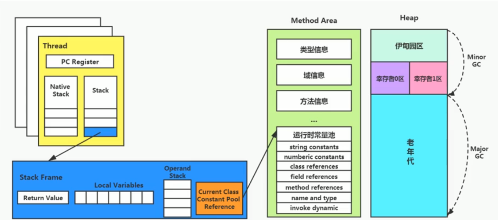
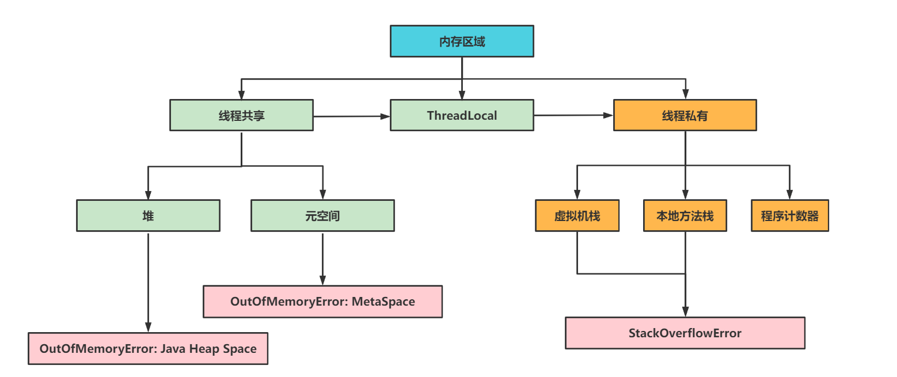

# Java 基础

## 计算机基础

* copy-on-write 用户态/系统态 fork()/exec()
* Orika 属性复制

# Java 新特性

# JUC

* volatile and synchronized
* 内存模型 happens-before 、 锁膨胀、double check lock
* 锁
    * AbstractQueuedSynchronizer
    * ReentrantLock
* 并发工具
    * CyclicBarrier
    * CountDownLatch
    * Semaphore
    * Exchanger
* 并发容器
    * ConcurrentHashMap、ConcurrentLinkedQueue、ConcurrentSkipListMap
* 阻塞队列
    * ArrayBlockingQueue、PriorityBlockingQueue、DelayQueue、SynchronousQueue、LinkedTransferQueue、LinkedBlockingDeque
* 线程池
    * ThreadLocal 本地线程保存值，或者线程池值的传递
    * TreadPoolExecutor:corePoolSize、maximumPoolSize、keepAliveTime、unit、workQueue
        * SingleThreadPool
        * FixedThreadPool
        * CachedThreadPool
        * ScheduledThreadPoolExecutor
    * Fork/Join 无锁编程框架，使用原子操作和内存屏障，用于计算密集型任务、大数据处理、递归算法
    * CompletableFuture

```java
        ExecutorService executorService = Executors.newSingleThreadExecutor();
        CompletableFuture<String> cf = CompletableFuture.supplyAsync(() -> {
            System.out.println("do something....");
            return "result";
        }, executorService);
 
        //等待子任务执行完成
        System.out.println("结果->" + cf.get());

```

# JMM 模型






* 方法区：存储了每一个类的结构信息，如运行时常量池、字段和方法数据、构造方法和普通方法的字节码内容。
* 堆：几乎所有的对象实例以及数组都在这里分配内存。这是 Java 内存管理的主要区域。
* 栈：每一个线程有一个私有的栈，每一次方法调用都会创建一个新的栈帧，用于存储局部变量、操作数栈、动态链接、方法出口等信息。所有的栈帧都是在方法调用和方法执行完成之后创建和销毁的。
* 本地方法栈：与栈类似，不过本地方法栈为 JVM 使用到的 native 方法服务。
* 程序计数器：每个线程都有一个独立的程序计数器，用于指示当前线程执行到了字节码的哪一行。

# JVM 优化

* 标记-复制 标记-清除
    * Marking Reachable Objects
    * Removing Unused Objects Mark、Sweep、Compact、Copy
* 四种GC（MinorGC、FullGC）
    * Serial GC 单核GC
    * Parallel GC 4-8核心使用、有卡顿、小型多核机器性能比G1要好、清理老年代和Metaspace
    * G1 垃圾最多的小堆会被优先收集
        * Evacuation
        * Concurrent Marking
            * Initial Mark
            * Root Region Scan
            * Concurrent Mark
            * Remark
            * Cleanup
        * Evacuation Pause
    * ZGC
* 优化关键指标 latency、throughput、capacity

# NIO/Netty

* 阻塞、非阻塞、异步、同步
* Netty
* Disruptor

# SpringIOC

* ApplicationContext BeanFactory

## 生态工具

# 工具库

- Hutool
- Google Guava

## 负载均衡

- Nginx
- Spring Cloud Gateway

## 分布式配置中心/注册中心

- Apollo
- Nacos
- Zookeeper
- Consul

## 服务调用

- Netty/gRPC
- Dubbo
- Sentinel
- Hystrix
- Spring Cloud Alibaba

## 任务调度

- XXL-JOB
- Elastic-Job

## 缓存中间件

- Redis
- Memcached

## 数据库连接池/分布式事务

- HikariCP
- Druid
- Seata
- TCC-Transaction

## 数据库中间件

- Sharding-Sphere

## 数据库

- MariaDB
- PostgreSQL
- TiDB
- ClickHouse：

## 搜索中间件

- Lucene：
- Solr
- Elasticsearch

## 消息中间件

- Kafka
- RocketMQ
- RabbitMQ

## 分布式预警监控

- Grafana
- Zabbix
- Spring Boot Admin
- Prometheus

## 分布式链路追踪

- Pinpoint
- Zipkin
- Sky-walking

## 安全&授权

- Shiro
- Spring Security
- OAuth 2.0
- JWT

# 参考

* 对 https://www.skjava.com/java-all 大体的方向是认可的，总结做了精简，重新整理下需要的知识点会持续补充更新这个页面。
