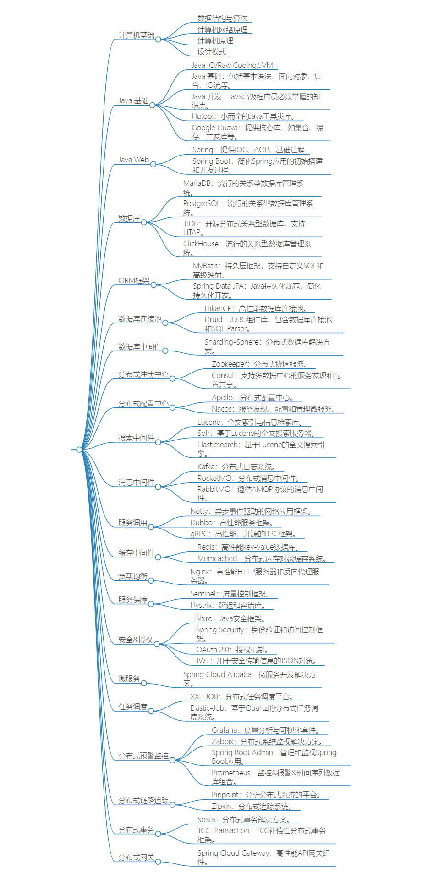

对 https://www.skjava.com/java-all 大体的方向是认可的，总结做了精简，重新整理下需要的知识点会持续补充更新这个页面。

## 计算机基础

- 数据结构与算法
- 计算机网络原理
- 计算机原理
- 设计模式

## Java 基础

- Java IO/Raw Coding/JVM
- Java 基础：包括基本语法、面向对象、集合、IO流等。
- Java 并发：Java高级程序员必须掌握的知识点。
- Hutool：小而全的Java工具类库。
- Google Guava：提供核心库，如集合、缓存、并发库等。

## Java Web

- Spring：提供IOC、AOP、基础注解
- Spring Boot：简化Spring应用的初始搭建和开发过程。

## 数据库

- MariaDB：流行的关系型数据库管理系统。
- PostgreSQL：流行的关系型数据库管理系统。
- TiDB：开源分布式关系型数据库，支持HTAP。
- ClickHouse：流行的关系型数据库管理系统。

## ORM框架

- MyBatis：持久层框架，支持自定义SQL和高级映射。
- Spring Data JPA：Java持久化规范，简化持久化开发。

## 数据库连接池

- HikariCP：高性能数据库连接池。
- Druid：JDBC组件库，包含数据库连接池和SQL Parser。

## 数据库中间件

- Sharding-Sphere：分布式数据库解决方案。

## 分布式注册中心

- Zookeeper：分布式协调服务。
- Consul：支持多数据中心的服务发现和配置共享。

## 分布式配置中心

- Apollo：分布式配置中心。
- Nacos：服务发现、配置和管理微服务。

## 搜索中间件

- Lucene：全文索引与信息检索库。
- Solr：基于Lucene的全文搜索服务器。
- Elasticsearch：基于Lucene的全文搜索引擎。

## 消息中间件

- Kafka：分布式日志系统。
- RocketMQ：分布式消息中间件。
- RabbitMQ：遵循AMQP协议的消息中间件。

## 服务调用

- Netty：异步事件驱动的网络应用框架。
- Dubbo：高性能服务框架。
- gRPC：高性能、开源的RPC框架。

## 缓存中间件

- Redis：高性能key-value数据库。
- Memcached：分布式内存对象缓存系统。

## 负载均衡

- Nginx：高性能HTTP服务器和反向代理服务器。

## 服务保障

- Sentinel：流量控制框架。
- Hystrix：延迟和容错库。

## 安全&授权

- Shiro：Java安全框架。
- Spring Security：身份验证和访问控制框架。
- OAuth 2.0：授权机制。
- JWT：用于安全传输信息的JSON对象。

## 微服务

- Spring Cloud Alibaba：微服务开发解决方案。

## 任务调度

- XXL-JOB：分布式任务调度平台。
- Elastic-Job：基于Quartz的分布式任务调度系统。

## 分布式预警监控

- Grafana：度量分析与可视化套件。
- Zabbix：分布式系统监视解决方案。
- Spring Boot Admin：管理和监视Spring Boot应用。
- Prometheus：监控&报警&时间序列数据库组合。

## 分布式链路追踪

- Pinpoint：分析分布式系统的平台。
- Zipkin：分布式追踪系统。
- Sky-walking 分布式追踪系统

## 分布式事务

- Seata：分布式事务解决方案。`
- TCC-Transaction：TCC补偿性分布式事务框架。

## 分布式网关

- Spring Cloud Gateway：高性能API网关组件。
