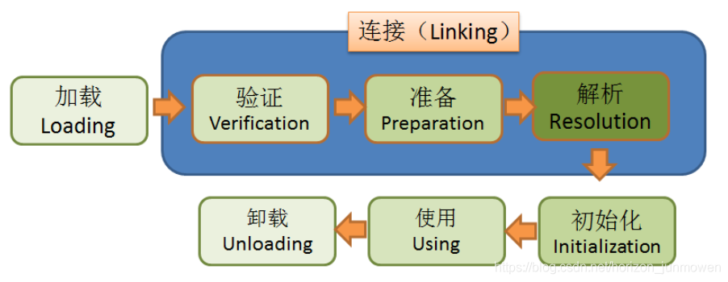
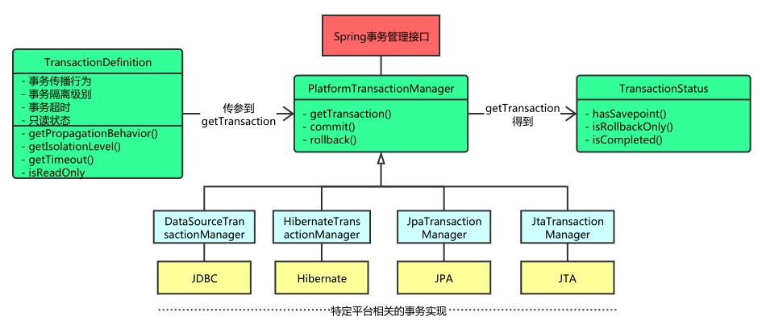

# 通用问题

## 自我介绍

简历上额外没有写的几点

1. 我在今年4月份在徐汇区买了房子，有学区可以解决我2岁女儿的教育问题
2. 我与我妻子的父母都已经退休，目前丈人一家卖掉深圳的房子回老家养老，我父母在帮助我带小孩
3. 我妻子目前工作在漕河泾，在互联网公司做大数据平台开发，主要涉及CDP和MA的业务，我在看他们源码，对应基于广告和推荐的一些我也能理解一下
4. 我上一份工作由于今年九月份公司有财务问题被裁员，虽然很遗憾但是这依旧是一家很棒的公司，我们主要是做药物研发方向，我最近2年大量的工作都是基于google
   patents 论文库做文本分析和搜索
5. 未来希望能继续以Java为主语言攻克软件问题，因为这门语言的生态成熟涉及到分布式系统整个生命周期十分完备。完全不排斥其他有市场竞争力语言的开发

我不是太擅长面试，如果很严肃可能会变成面试考试，所以希望能轻松点聊些知识，如果可以我很愿意结交朋友，我在上海没有什么亲戚，请你说

## 介绍几个拿的出手的项目? (15分钟)

1，在杭州光云软件做的通用日志架构查询服务
2，在上海冰洲石做数据标注业务，主要是对google patent论文库做清洗和文章NLP抽取三元组信息

## 为什么离职？

```markdown
公司去年10月份有财务困难，今年融资失败，9月份大规模裁员接近50%。
家庭情况，每天通勤3小时，工作比较疲劳频繁晚上凌晨要开会，或者做进度code_review
但是工作工作氛围在下降，但是公司对员工还是十分尊重，我非常感激能给我这个机会

我还是希望能进一家有稳定上升期的公司，能够有好的业务沉淀，可以持续创造价值，我希望跟聪明人一起工作。
我自己曾经校招是去杭州一家50人的创业公司，当时团队气氛非常好，公司十分开放，从老板到员工全部都很努力，也愿意加班彼此融洽。后来一直做到上市。我一直怀念在杭州工作那段日子，但是由于个人经济问题和感情问题而各种离开。
```

## 未来两年的职业规划

```markdown
1.我漂泊太久了，今年四月份徐汇区花了巨大的代价安置学区房，未来两年我希望好好补齐自己的技术短板，好好沉淀，稳定家庭和事业。
2.如果有机会我希望有时间能做一些技术分享，多社交，我懂的知识很杂，但是都很实用。
3.我不太希望晋升管理层，我看过很多简历好像人人都想当管理层，索性我就不当了，我只有一点期望，能安心写我的代码做一个纯粹的人。
```

## 你对我还有问题?

1. 公司是否提供网络，希望能用自己的设备或者大内存设备、或MacBook
2. 想了解下公司业务未来的发展方向，以及我可能未来接触到的团队是什么样的人
3. 现在公司已经在XX业务有自己的产品线了，未来还会遇到哪些挑战
4. 从你的角度看，你需要一个怎么样的研发成员，你对全栈就是技术不成熟东学学西学学是不是一种没有职业规划表现
5. 现有的商业模式已经固化，生产资料饱和，我们怎么突出重围，建立自己的壁垒
6. 目前公司的技术架构选型是怎么样的？未来是打算全部上云还是自己建立机房?

# 场景题

场景问题主要是让你找product sense，所以其实答案本身不重要，你需要充分和面试官沟通询问模块细节，了解用户人群，需求分析，流程分析，简单设计，上线预言，维护监控
尝试用MECE（Mutually Exclusive Collectively Exhaustive）法做问题拆解，首要是能把問題拆小，讓我們能更好理解。

* 加法拆解，问题分布
* 乘法拆解，细分考虑各种场景

## 如何做稳定性保障？（发散问题）

```markdown
# 稳定性保障策略

Google SRE

- **服务隔离**：通过容器化技术隔离服务，防止故障蔓延。
- **负载测试**：使用Apache JMeter等工具模拟用户访问，评估系统性能。
- **压力测试**：逐渐增加负载，测试系统在极限条件下的表现。
- **容量规划**：根据业务需求进行容量规划，确保系统应对流量变化。
- **实时监控**：使用Prometheus、Grafana监控系统运行时指标。
- **告警机制**：设置告警阈值，系统指标异常时及时告警。
- **限流**：使用Sentinel等工具设置限流策略，防止系统过载。
- **熔断**：使用Hystrix或Resilience4j实现熔断机制，防止故障蔓延。
- **本地缓存**：使用Guava Cache或Ehcache实现本地缓存。
- **分布式缓存**：使用Redis等存储全局共享数据，提升性能。
- **统一异常处理**：使用AOP统一捕获和处理服务层异常。
- **降级策略**：临时关闭非关键功能或简化复杂功能，确保核心服务稳定。
- **分布式追踪**：使用SkyWalking、Zipkin等工具实现分布式追踪。

## 参考资料

- [阿里云开发者社区](https://developer.aliyun.com/article/782540)
- [性能测试与负载均衡](https://developer.aliyun.com/article/1554956)
- [系统稳定性与高可用保障](https://zhuanlan.zhihu.com/p/579442834)
- [实时监控和警报系统](https://developer.aliyun.com/article/1558688)
- [Java应用系统稳定性方案](https://blog.csdn.net/weixin_39304656/article/details/142685720)
```

## 如果对于大量的用户实现任务积分制，再用积分增加抽奖权重，最后抽奖这个系统怎么设计？/对于抖音的福袋怎么设计？

首先奖池、然后权重概率清理库存、设计梯度奖品让其“上瘾”
比如[1,25,45,75]random.int()* sum([]), 然后排序，看值在哪个区间

## 对于微信红包业务怎么设计？

```bash
lpushall RED_PACKAGE_KEY+red_id [10,10,10,10] ttl=1 day
get RED_PACKAGE_CONSUME_KEY+red_id,user_id
lpop RED_PACKAGE_KEY +red_id
put RED_PACKAGE_CONSUME_KEY+red_id,user_id,10

// 二倍均值法
// 每次抢到的金额=随机区间(0,(剩余红包金额M÷剩余人数N)X2)

private Integer[] splitRedPackage(int totalMoney, int redPackageNumber)
    {
        int useMoney = 0;
        Integer[] redPackageNumbers = new Integer[redPackageNumber];
        Random random = new Random();

        for (int i = 0; i < redPackageNumber; i++)
        {
            if(i == redPackageNumber - 1)
            {
                redPackageNumbers[i] = totalMoney - useMoney;
            }else{
                int avgMoney = (totalMoney - useMoney) * 2 / (redPackageNumber - i);
                redPackageNumbers[i] = 1 + random.nextInt(avgMoney - 1);
            }
            useMoney = useMoney + redPackageNumbers[i];
        }
        return redPackageNumbers;
}
```

## Redis要做百万级别的数据插入怎么做

* 批处理
    * pipeline
    * MSET/HMSET 命令
* 数据分片
    * 集群分散写入
* 使用Lua脚本
    * 将多个操作组成一个原子操作
* 异步加载

# 部分问题集合

#### Fordeal 跨境电商

1. 技术选型为什么用mysql，还能改成其他加快你的业务吗

```markdown

MySQL使用范围广，但是有出现社区闭塞没有活跃的现象，可以考虑平替MariDB或者PostgralSQL关系型数据库，或者使用更强的TiDB或者Greenplum分布式关系型数据库，如果涉及到有检索方面能力的可以改造成es和mysql同步，如果大量的宽表并没有对范式有强依赖，极端情况使用mongodb这种NoSQL数据库加强查询性能。
对于绝大多小型项目MySQL足矣，建议直接上云增强硬件和可靠性方向，不要改架构
```

2. redis持久化方案会存在什么问题? 影响你的性能吗? redis持久化方案 都有什么优缺点？

```markdown
AOF 有阻塞，当文件满要重新刷盘，但是实时性好。
缺点：文件体积大，恢复速度慢，受到IO影响
优化：

1. appendfsync:everysec
2. 设置`auto-aof-rewrite-percentage`和`auto-aof-rewrite-min-size`配置自动触发AOF文件重写，减小AOF文件体积

RDB 没有阻塞，fork快照方法更新，有幻读。
缺点：fork操作大数据集可能耗时，影响到IO
优化：

1. 使用bgsave减少阻塞
2. 可以使用混合的persist

其他优化

1. 尽量使用hash、或者避免大值的读写
2. 使用slowlog查redis的慢日志
3. linux内核侧的参数调整
```

3. ES 怎么去做索引更新的？

```markdown
es有一个全局刷新时间，未刷新前用户都是看到旧数据，可以在批量刷新数据的时候禁用refresh_time 阻止强制刷新，跑批完后再启用

1. 单个文档_update命令更新
2. 批量文档_bulk命令，要设置一个设施bluk_size

indices.memory.index_buffer_size=增加缓冲区
index.translog.durability=async 异步事务提高刷新磁盘性能
```

#### VV

1.Dubbo内部细节
https://cn.Dubbo.apache.org/zh-cn/docsv2.7/dev/implementation/

```markdown
1. 核心组件 Registry/Provider/Consumer/Monitor
2. 实现细节：通过（Service/reference）Config解析URL格式作为数据通讯，从 DubboProtocl 传输到 RegisteryProtocl，数据拦截通过Filter
   链式整合，当收到一个请求，会找到对应的exporter，然后通过invoker（AbstractProxyInvoker ）调用
3. SPI扩展，是一种JAVA 官方库的扩展实现
```

2.Dubbo是怎么做流控的 流控的几个算法

```markdown
流控算法

* 自适应限流 HeuristicSmoothingFlowControl/AutoConcurrencyLimier
* P2C算法 connections/load to choice smallest

限流其他限制

* 熔断机制 失败次数超过阈值，Sentinel、Hystrix、Resilience4J
* 服务降级 直接不可用 `@DubboReference(mock = "return null")`
```

3.讲讲Dubbo通信协议netty 如何解决粘包问题

```markdown
1. FixedLengthFrameDecoder 固定长度补齐
2. DelimiterBasedFrameDecoder 分割符识别
3. LengthFieldBasedFrameDecoder 标记长度 （推荐）
4. 自定义协议和编码器
5. 使用Netty的编码器和解码器，例如，`LineBasedFrameDecoder`会自动以行为单位处理消息，而`DelimiterBasedFrameDecoder`
   可以根据自定义的分隔符来分割消息
```

4.Dubbo有哪些序列化 都有什么区别?

```markdown
除了RMI以外，Dubbo官方提供很多的案例

1. Hssian 稳
2. FST/Kryo 快
3. Fastjson/Gson JSON 可读性跨语言
4. Protobuf 跨语言，压缩高效
```

5.让你设计序列化 你会从哪几个方面去思考?

```markdown
速度/性能/IO效率
```

7.redis string zset 底层数据结构是怎么实现的 优缺点

```markdown
String 内存结构
len/free/buff[]
优点：1.内存不用重新分配 2.二进制安全 3.缓冲区溢出保护

Zset底层数据结构

* ziplist 修改成本高，结构紧凑，节省内存
* skiplist 查询速度快，占用内存多
```

9.jdk1.7 1.8的区别 hashmap 为什么方法区改成metaspace

```markdown
避免固定PermGen GC爆炸，减少GC活动，使用非堆内存

Metaspace 使用 Native Memory，自动扩展，当classloader被回收直接清空，减少内存溢出风险
```

#### 有赞一面

2.缓存穿透,缓存雪崩问题

```markdown
缓存穿透 1.增加校验 2.对空值缓存 3. 布隆过滤器
缓存雪崩 1.分化过期时间 2.提前预热缓存 3.多级缓存 4.redis高可用
缓存击穿 1.加锁等待 2.永不过期，异步方式更新数据
```

3.消息队列遇到的问题：消息顺序消费 消息可靠性保障 消息幂等

```markdown
1. 保障 partition 中可以顺序消费，业务层面序列号和时间戳来保证消息正确
2. 可靠性用集群保证，通过kafka的ack机制来保证callback，用副本和重试来增加鲁棒性，保证消息被正确消费然后提交callback
3. 消息幂等，额外数据库存储 offset id，消费完同步状态
```

5.MySQL索引的树结构

```markdown
B/B+ 树:所有数据在叶子，非叶子阶段更多关键字，适合page存储
联合索引AB，前序命中规则，即 A命中 B命中，AB命中，BA不会命中
```

7.讲讲回表查询 什么情况下会走会表查询

```markdown
避免全表扫描和差的索引列，优先命中性能高的列，使用covering index组合索引来优先命中
```

10.MySQL如何避免死锁问题

```markdown
多个事务交叉获取锁

1. 索引减少冲突，加速查询
2. 保证加锁顺序一致
3. 减少事务锁定时间
4. 减少并发
5. 表锁直接代替行锁
6. 锁定更小的范围
7. 分批提交
8. 设置不同的事务级别
9. 加锁操作select for update 
```

#### 滴滴一面

1.分流算法(30%流量 或者 30%用户群体)

```markdown
取模
```

3.分库分表

```markdown
垂直分表
水平分表 用户ID 订单ID
时间分表
MySQL hash分区
```

5.RocketMQ的优点，怎么达到那么快？

```markdown
高性能和低延迟: CommitLog 顺序读写、零拷贝
消息可靠性保障: 容灾、多种消息模式
```

7.RocketMQ消息丢失的情况

```markdown
消费异步刷盘/主节点拱机/消费阶段没有消费完就已经ACK了
```

8.RocketMQ事务消息具体流程

```markdown
发送端二次确认，消费端消费完毕完成ACK回传，消息事务会发起消息回查
```

9.es和mysql数据同步如何保证

```markdown
单数据同步更新
单数据异步更新
es后台主动更新
binlog更新
```

10.mysql索引失效的情况

```markdown
计算函数，类型问题，OR条件，like字符，左前缀法则，非等，not in ,not exists, 使用limit 没有order by
```

11.慢SQL如何发现

```markdown
slowlog
jdbc中间件
apm监控
explain
```

12.如何优化慢SQL

```markdown
优化索引，减少扫查询回表，优化本身硬件能力，使用缓存
```

13.explain 关键指标

```markdown
cost key 
```

14.性能监控你都看哪些指标

```markdown
cpu idle usage 温度
free -m
io
network io

gc
jmm
uv/pv
tps/qps

exception
exception count
exception rate

thread count
queue length

lock
硬件健康状况 
```

#### 淘特一面

2.synchronized 的原理和升级过程

```markdown
1.字节码 monitorenter/monitorexit 两个指令，常量池也会多出 ACC_SYNCHRONIZED
2.升级版本 ReentrantLock

```

3.ThreadLocal介绍和原理

```markdown
线程用的存储空间，做session存储使用，使用完毕要执行remove()操作内存释放

```

4.Spring单例和多例的区别 什么时候创建 什么时候销毁

```markdown
# Singleton

Spring容器启动时创建，加载进FactoryManager中，在spring容器关闭后销毁，也可以实现disposableBean销毁, 整个Spring容器中只有一个Bean实例

# Prototype

每次请求会创建一个新的Bean实例，外部代码控制销毁时间

# 其他作用域

Request/Session/Application/WebSocket

```

5.Spring Bean生命周期

```markdown
@Construct
Set
@Destroy
```

6.类加载的流程,双亲委派


```markdown
loading->validation->prepare memory（method area）->solving->initial

The Java platform uses a delegation model for loading classes. The basic idea is that every class loader has a “parent”
class loader. When loading a class, a class loader first “delegates” the search for the class to its parent class loader
before attempting to find the class itself.

双亲委派，Bootstrap->Extension->Application Class Loader，避免重复加载和核心API被篡改
```

7.类加载数据存在哪里 讲讲JVM Method Area
https://blog.csdn.net/qq_51628741/article/details/124524828


```markdown
存储类的位置，目前Metaspace已经使用，减少GC和OOM的影响
类信息 域信息 方法信息 常量池 Thread信息 StringTable

内部结构

1. 类信息 class interface enum annotation
2. Field信息 public，private，protected，static，final，volatile，transient
3. Method信息 方法名称、return、修饰符、字节码、异常表
4. runtime常量池 
```

8.分布式锁原理

```markdown
violate synchronized

```

9.线程池的用途 线程池的流转原理
https://tech.meituan.com/2020/04/02/java-pooling-pratice-in-meituan.html

```markdown
ThreadPoolExecutor 类，利用多线程提高吞吐量

# 线程池有五种状态：

RUNNING：会接收新任务并且会处理队列中的任务
SHUTDOWN：不会接收新任务并且会处理队列中的任务
STOP：不会接收新任务并且不会处理队列中的任务，并且会中断在处理的任务（注意：一个任务能不能被中断得看任务本身）
TIDYING：所有任务都终止了，线程池中也没有线程了，这样线程池的状态就会转为TIDYING，就会调用线程池的terminated()
TERMINATED：terminated()执行完之后就会转变为TERMINATED

# 这五种状态并不能任意转换，只会有以下几种转换情况：

RUNNING -> SHUTDOWN：手动调用shutdown()触发，或者线程池对象GC时会调用finalize()从而调用shutdown()
(RUNNING or SHUTDOWN) -> STOP：调用shutdownNow()触发，如果先调shutdown()紧着调shutdownNow()，就会发生SHUTDOWN -> STOP
SHUTDOWN -> TIDYING：队列为空并且线程池中没有线程时自动转换
STOP -> TIDYING：线程池中没有线程时自动转换（队列中可能还有任务）
TIDYING -> TERMINATED：terminated()执行完后就会自动转换

通过 interrupt() 来停止线程

newSingleThreadExecutor 单线程池
newFixedThreadPool 固定大小的线程池
newCachedThreadPool 缓存线程池
newScheduledThreadPool 定时周期性执行

```

#### JD一面

1.数据库锁问题，并发操作 X锁 S锁 间隙锁

```markdown
乐观锁和悲观锁，粒度：表锁、行锁、全局锁

* S锁
  READ锁，多个事务对于同一数据共享一把锁，都能访问到数据，但是只能读不能修改
* X锁
  WRITE锁，排他锁就是不能与其它锁并存，如一个事务获取了一个数据行的排他锁，其他事务就不能再获取该行的其他锁，包括共享锁和排他锁，但是获取排他锁的事务是可以对数据就行读取和修改。排他锁又称为写锁，简称X锁，可以不加锁的查，加锁的查是不可以的。
```

2.分布式锁实现原理 zk redis实现的优缺点

```markdown
Raft 和 Paxso， Redis以前是Gosip模式，现在好像也是Raft

```

3.线程池内部逻辑 拒绝策略

```markdown
* AbortPolicy - 抛出异常，中止任务。抛出拒绝执行 RejectedExecutionException
  异常信息。线程池默认的拒绝策略。必须处理好抛出的异常，否则会打断当前的执行流程，影响后续的任务执行
* CallerRunsPolicy -
  使用调用线程执行任务。当触发拒绝策略，只要线程池没有关闭的话，则使用调用线程直接运行任务。一般并发比较小，性能要求不高，不允许失败。但是，由于调用者自己运行任务，如果任务提交速度过快，可能导致程序阻塞，性能效率上必然的损失较大
* DiscardPolicy - 直接丢弃，其他啥都没有
* DiscardOldestPolicy - 丢弃队列最老任务，添加新任务。当触发拒绝策略，只要线程池没有关闭的话，丢弃阻塞队列 workQueue
  中最老的一个任务，并将新任务加入

```

4.算法题 100个城市不同的权重 按照权重随机如何实现

```markdown
一个数据段，然后区间按比例分配，丢随机数或者有序Id取模
```

7.大量慢SQL如何优化

```markdown
缺少索引：没有为查询涉及的列创建适当的索引，导致数据库需要全表扫描来找到匹配的行。
错误使用索引：使用了索引但不符合最左前缀原则，或者索引选择度不高（即索引列的唯一性不够高），导致数据库选择不到最优的索引执行查询。
查询字段过多：SELECT 语句中涉及的字段过多，增加了数据传输和处理的开销。
多次回表：查询执行过程中需要多次访问磁盘以获取额外的数据行，例如对主键的索引扫描后，需要再次根据主键进行查询。
多表连接：涉及多个表的 JOIN 操作，若 JOIN 条件不合适或者 JOIN 操作没有利用到索引，会导致性能下降。
深度分页：需要返回大量数据中的某一页，但是没有合适的方式来快速定位和获取这一页数据。
其他因素：还有一些其他可能的原因，例如复杂的子查询、数据库服务器负载高、SQL 语句写法不佳等。

拆分
```

#### 网易二面

2.redis list

```markdown
compress list
skip list
```

3.es底层如何查询倒排索引什么算法 复杂度

```markdown
倒排索引 + TF-IDF打分算法
用 Lucene 分词Term，然后存储用链表、二分法查询。
用发Finite State transducer 查询复杂度 O(len(str))
FST(Trie树)是将单词拆成单个字母存在节点上，每个节点存一个字母，根节点不存，从根节点出发到特定节点所经过的字母就可以组成目标单词

TF-IDF打分 TF*IDF
```

4.ES如何优化

```markdown
硬件层面，先把磁盘换成M2，加大内存，谢谢

内核层面 关闭swap，增加内存

-XX:+UseG1GC
-XX:MaxGCPauseMillis=50

index.refresh_interval=-1 关闭延迟写入（链路日志可以设置为30s）
indices.memory.index_buffer_size: 10%
indices.memory.min_index_buffer_size: 48mb
index.translog.sync_interval: 5s
index.translog.flush_threshold_size: 512mb

减少副本数量
查询上尽量用 filter 代替 query
尽量不要大深度翻页
multi_match越多越慢，可以copy到一个新字段然后match
优化 aggregation 性能
```

5.Dubbo SPI 实现原理

```markdown
首先Java SPI 是使用 ServiceLoader 加载 `META-INF/services` 的文件
再看Dubbo SPI 是使用 ExtensionLoader， 预读 `META-INF/dubbo` 下面的内容，更好的支持对同接口的不同实现

线程安全的单列工厂，然后基于反射创造实例，加载资源解析和配置。Dubbo 的IOC基于setter注入依赖
```

6.Dubbo 整个调用流程

```markdown
首先服务消费者通过代理对象 Proxy 发起远程调用，接着通过网络客户端 Client 将编码后的请求发送给服务提供方的网络层上，也就是
Server。Server 在收到请求后，首先要做的事情是对数据包进行解码。然后将解码后的请求发送至分发器
Dispatcher，再由分发器将请求派发到指定的线程池上，最后由线程池调用具体的服务。这就是一个远程调用请求的发送与接收过程。
```

7.Spring Bean加载过程

```markdown
ApplicationContext BeanFactory
```

8.Spring事务的原理



```markdown
呼起 autocommit=On begin;end; 本身基于AOP实现

## 事务操作相关的API：

Spring事务@Enanle模块驱动 - @EnableTranSactionManagement
Spring事务注解 - @Transactional
Spring事务事件监听器 - @TransactionalEventListener

## 事务抽象相关的API

Spring平台事务管理器 - PlatformTransactionManager
Spring事务定义 - TransactionDefinition
Spring事务状态 - TransactionStatus
Spring事务代理配置 - ProxyTransactionManagementConfiguration

## AOP相关的API

Spring事务PointcutAdvisor实现 - BeanFactoryTransactionAttributeSourceAdvisor
Spring事务MethodInterceptor实现 - TransactionInterceptor
Spring事务属性源 - TransactionAttributeSource
其中，PlatformTransactionManager、TransactionDefinition、TransactionStatus最为重要，他们之间的关系如下：


```

    @Transactional(rollbackFor=Exception.class)

    @Autowired
    TransactionTemplate transactionTemplate;

```

```

9.filter interpret aop的执行顺序

```markdown
@Order
Filter 这个获取设置的链路请求 MDC/ThreadLocal
Interceptor
AOP @around

```

10.AOP代理 动态代理的实现 区别

```markdown
CGlib接口 字节码的修改
DynamicInvoke接口 官方的接口
```

11.服务链路如何实现(ELK+SkyWalking)

```markdown
https://skywalking.apache.org/zh/2020-04-19-skywalking-quick-start/
Dapper 论文
```

12.ThreadLocal/子线程问题, 如何传播

```markdown
父子线程通信，当ThreadLocal中数据变动，子线程同步。 会在线程创建时传递 InheritableThreadLocal
使用方法
https://github.com/alibaba/transmittable-thread-local

* 分布式跟踪系统（链路追踪）
* 日志收集记录系统上下文（MDC）
* Session级Cache
* 应用容器或上层框架跨应用代码给下层SDK传递信息
```

13.Java的参数传递是「按值传递」还是「按引用传递」？

```markdown
1. Java基本数据类型传递参数时是值传递；引用类型传递参数时是引用传递。
2. 值传递时，将实参的值传递一份给形参；引用传递时，将实参的地址值传递一份给形参
3.

值传递时，实参把它的值传递给对应的形参，函数接收的是原始值的一个拷贝，此时内存中存在两个相等的基本类型，即实参和形参，后面方法中的操作都是对形参这个值的修改，不影响实参的值。引用传递时，实参的引用(
地址，而不是参数的值)被传递给方法中相对应的形参，函数接收的是原始值的内存地址；在方法执行中，形参和实参内容相同，指向同一块内存地址，方法执行中对引用的操作将会影响到实际对象。
4.需要特殊考虑String，以及Integer、Double等几个基本类型包装类，它们都是immutable类型，因为没有提供自身修改的函数，每次操作都是新创建一个对象，所以要特殊对待。因为最后的操作不会修改实参，可以认为是和基本数据类型相似，为值传递。
```

14.是否了解字典树

```markdown
字典树又称单词查找树，Trie 树，是一种树形结构，是一种哈希树的变种。典型应用是用于统计，排序和保存大量的字符串（但不仅限于字符串），所以经常被搜索引擎系统用于文本词频统计。
它的优点是：利用字符串的公共前缀来减少查询时间，最大限度地减少无谓的字符串比较，查询效率比哈希树高（空间换时间）。
Trie 的核心思想是空间换时间，利用字符串的公共前缀来降低查询时间的开销以达到提高效率的目的。

它有 3 个基本性质：

* 根节点不包含字符，除根节点外每一个节点都只包含一个字符。
* 从根节点到某一节点，路径上经过的字符连接起来，为该节点对应的字符串。
* 每个节点的所有子节点包含的字符都不相同。
* 对于中文的字典树，每个节点的子节点用一个哈希表存储，这样就不用浪费太大的空间，而且查询速度上可以保留哈希的复杂度 O(1)。
```
