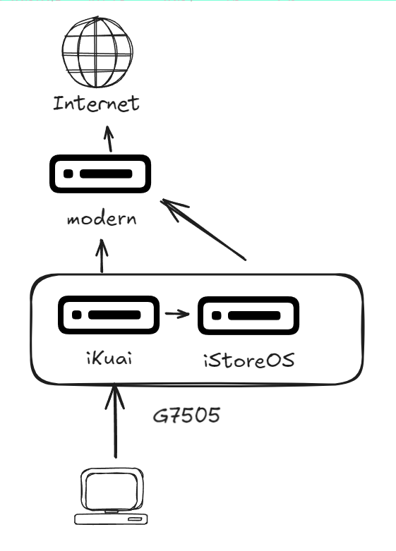
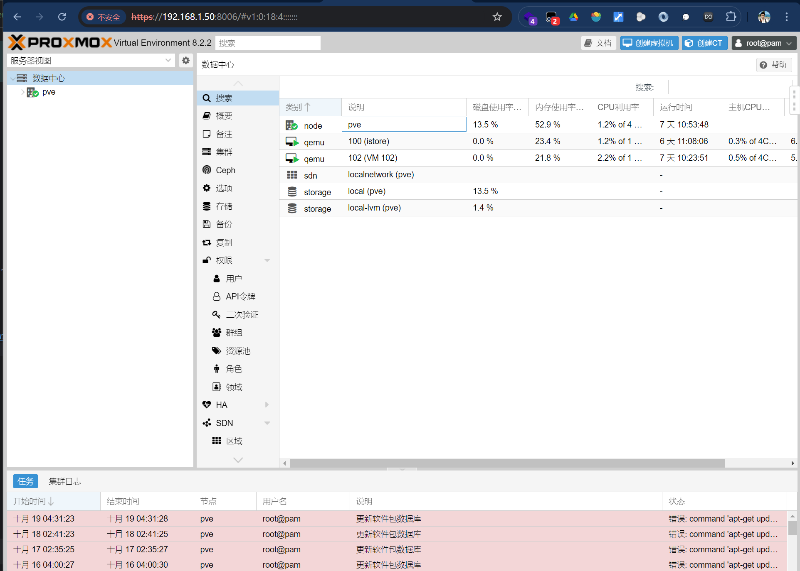
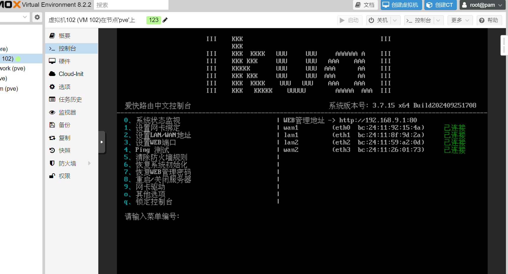
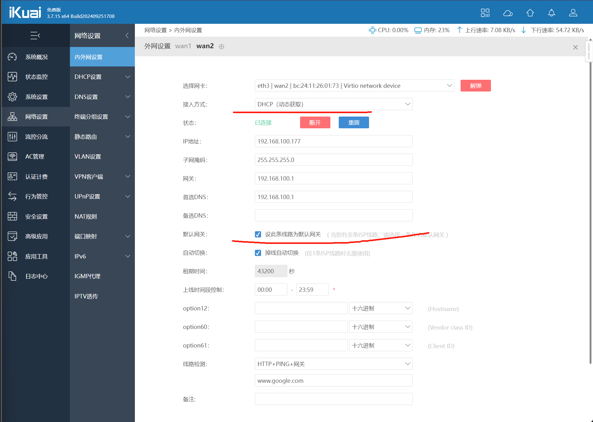
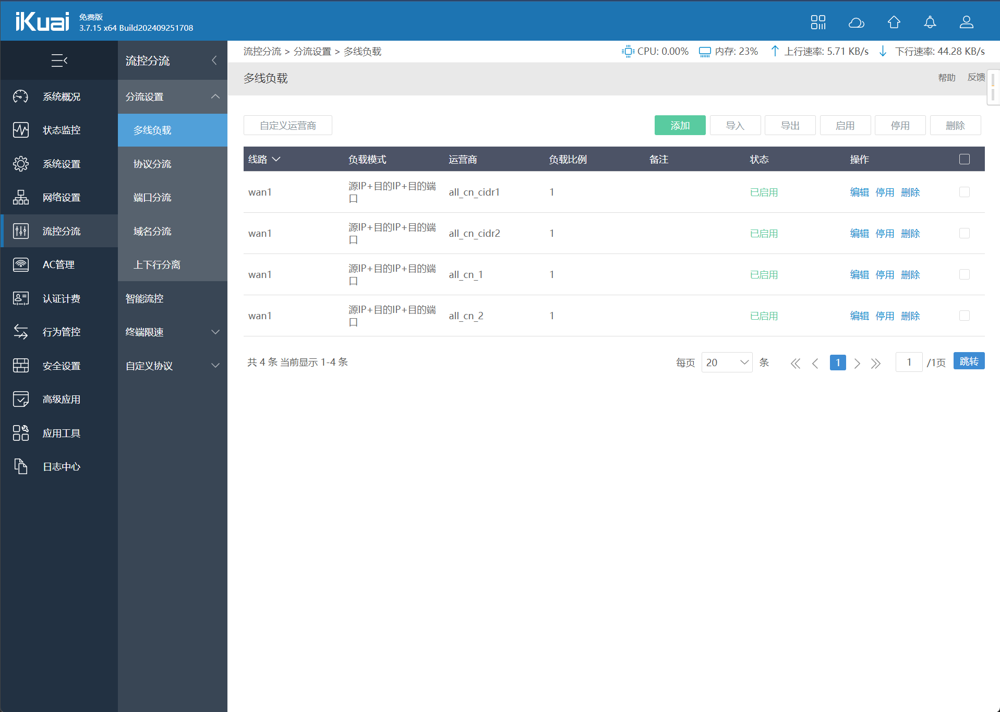
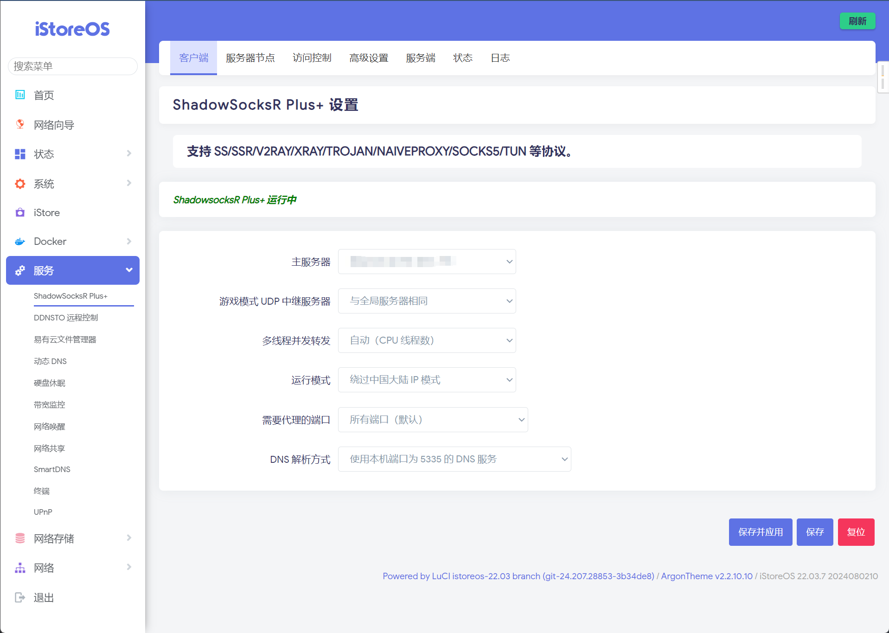
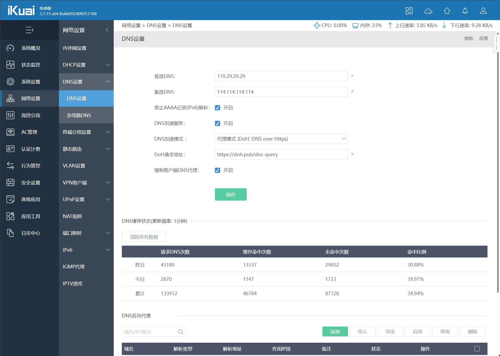

全家科学上网，IP自动分流，代理网络断线不影响主网络

## 路由器配置

* 康耐信 G7505 的六个千兆I226V网口 656RMB
* 闲鱼海力士BC711 128G 39RMB
* 内存条Crucial DDR4 3200 8G 99RMB

如下图，接下来的事情是要在服务器上配置PVE、ikuai、istore，保证网络正常，这里主要是使用iKuai的IP分流策略，保证主路由自动分流，不被旁路由影响。


## 开始安装

### 第一步 安装PVE

没啥好说的，[下载ISO](https://pve.proxmox.com/wiki/Downloads)，优盘[安装ventoy](https://www.ventoy.net/cn/index.html)
,修改系统引导，安装没有任何难度。注意这里需要先接一个显示器看看PVE的IP分配情况，免得折腾，页面如下图，简单介绍下使用。


1. 一般来 sources 里面会有两个存储盘，可以上传iso镜像，如果需要上传其他文件改后缀名就行。
2. 找到主服务器选项，点击【网络】需要对物理卡设置Linux Bridge，这样可以暴露到虚拟机当中去，同时公用端口。如果没有端口公用需求的，可以在虚拟机设置里直接PCI直连
3. 硬件-BIOS 有两种 UEFI/SeaBIOS 注意镜像鉴别
4. 选项-引导顺序 注意更改
5. 右上角【创建虚拟机】

### 第二步 安装iKuai

1. [下载64位 ISO](https://www.ikuai8.com/component/download)
2. 先不急启动，挂载好至少2个WAN口和所需要的LAN口
3. 启动后会发现iKuai会申明一个static IP，把本机改成同网域下，使用web端访问
   
4. 设置WAN2口为默认网关并开启DHCP
   
5. 设置【流控分流】，找到【多线负载】，点击【自定义运营商】，把 https://ispip.clang.cn/ 所有 china_ip 导入，并`设置负载全部走线路wan1`
   
6. 设置WAN1口开启DHCP，尝试是否已经联通国内网站

### 第三步 安装iStoreOS

1. [下载x86_64](https://fw.koolcenter.com/iStoreOS/) 注意efi对应BIOS是否启用UEFI，两个都能使用。
2. 挂载好WAN口和LAN口，然后启动镜像，根据对应IP设置本机IP，使用web端访问
3. 默认账号root/password，进入后点击iStore，手动安装[科学上网包](https://github.com/AUK9527/Are-u-ok/tree/main/x86)
   ，注意PassWall2/SSR+二选一，直接.run上传导入。
4. 点击【服务】的ShadowsocksR，设置对应科学节点，在【检查】中查看谷歌的连通性（这里有时候会失败不重要）
   

### 第四步 部署网络

1. 此时可以把iStoreOS的WAN/LAN按照拓扑图部署，设置iKuai的DNS服务指向iStore或者用净化公网的DNS服务
   
2. 可以通过iKuai设置WAN口的【断开】，来单向测试两个主WAN口的网络是否联通，同时本机使用以下命令检查DNS服务和网络是否正常

```bash
nslookup google.com
dig google.com
```

至此所有设置完毕，祝好！